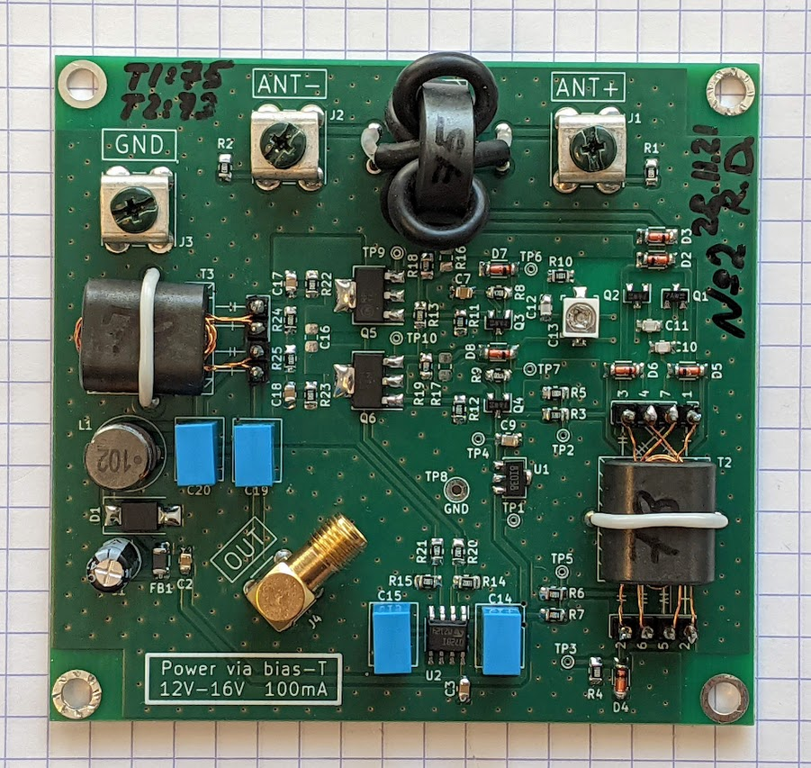
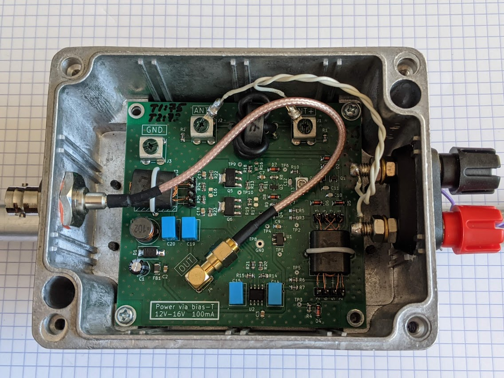
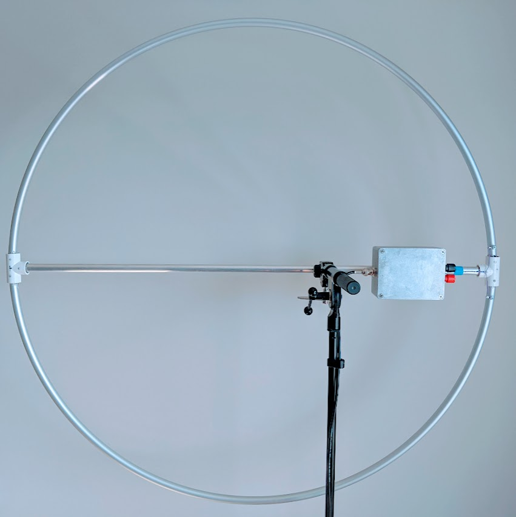

# About

**Lomiloop** is a wideband directional receiving loop antenna amplifier.

With it, you can build antennas that look like [this](docs/ant1.jpg).

It was designed for thick single-turn coreless loops with high area and low
inductance, that are electrically small compared to the wavelength of received
signal. With ~1.0m dia. loop, this allows to build an antenna that is
moderately portable, wideband, displaying almost flat antenna factor throughout
band of interest (approx. 50 kHz to 10 MHz), and has high enough sensitivity and
discrimination of near-field E-field noise sources that it can be used for
receiving LF and MF bands in urban areas. Usage of HF is possible, although not
recommended due to:
- Antenna noise which is noticeably higher than the atmospheric noise in HF band
- Wave effects in the loop on frequencies above ~15 MHz.

# Schematic and PCB

All the files here were designed in KiCad 5.1.10.

Schematic is also available in [PDF format](docs/schematic.pdf).

The PCB that is presented in this repository was specifically designed for
*Gainta G113* aluminium housing (also sold under Velleman brand in EU). For coax
connection, it uses female SMA connector to which BNC-SMA pigtail is then
connected, and Keystone 7771 screw terminals for loop connection. Actual loop is
wired to the binding posts which are mounted on the housing and then wired to
the Keystone terminals on the PCB.

Photos of assembled PCB:

<table>
  <tr>
    <td></td>
    <td></td>
   </tr> 
</table>

# Loop selection

Author uses D=90cm circular loop made from aluminium pipe d=15mm with wall
thickness s=1mm. This loop has a measured inductance of 2.46 uH at 1 MHz.

Originally it was an anodized aluminium hulahoop from NiroSport brand, ends of
which have been spread, a middle d=16mm aluminium pipe have been added and fixed
in place using T-pieces and epoxy. The end result is visible on the 
photo:

# Background

Long ago I became interested in reception of long- & mid-wave radio stations -
it all started with an unfinished
[Loran C receiver](https://github.com/RomaVis/LoranC) project that I've designed
for my BSc.

What that project made clear is that reception of LW/MW/HF signals in the
typical urban setting is challenging and in many cases impossible due to
man-made noise sources such as unfiltered cheapo switching power supplies,
HomePlug / PLT adapters, etc.

Of course, some noise filtering can be done later down the chain (e.g. in DSP in
case of an SDR receiver), but it's well known that any radio begins with an
antenna: the antenna amplifier usually sets the noise floor of the system and
antenna is usually the only element that has access to physical quantities that
are not representable after the signal gets into the cable, such as EM wave
direction and E-to-H field ratio. Being able to improve SNR by using a proper
antenna design will make further signal processing significantly simpler and
sometimes is a factor that determines whether the signal can be received or not,
no matter how complicated the DSP processing is.

Antenna design that is well-suited to urban usage on LW/MW bands is a
[loop antenna](https://en.wikipedia.org/wiki/Loop_antenna) which has two key
traits:
- Directivity pattern with strong null in two directions.
- Predominantly H-field sensitivity.

This allows to "null out" a single point-like noise source, as well as, compared
to "E-field" antennas such as MiniWhip, reduce receiver sensitivity to the
man-made noise that comes from unefficient near-field radiators that produce EM
field wherein [wave impedance](https://en.wikipedia.org/wiki/Wave_impedance) is
significantly higher than the
[impedance of free space](https://en.wikipedia.org/wiki/Impedance_of_free_space).

# Circuit description

See schematic in [PDF](docs/schematic.pdf).

Signal path in the amplifier is as follows:
- J1, J2 - screw terminals to which loop is connected.
- T1 - DC-isolation transformer for the loop.
- Q1, Q2, T2 - differential common base amplifier with augmentation.
- Q3, Q4 - emitter follower.
- Q5, Q6 - differential amplifier with 200 ohm output impedance.
- T3 - output 200/50 ohm balun to drive coax line.
- J4 - 50-ohm coaxial cable connector that carries output signal (AC) as well as
  supply voltage for the amplifier (DC).

One of design goals for the amplifier was to present very *low* impedance to the
loop, around 0.5-1.0 Ohm. Loop loaded with active impedance exhibits a high-pass
response, where cutoff frequency *decreases* as amplifier impedance *decreases*.
To achieve a cutoff on the order of 50-100kHz with common loop inductances (2-4
uH) input impedance of the amplifier should be this low.

Transformer T1 provides DC isolation of the loop, which is necessary since right
side of it (looking at the schematic) is biased to approx. ~1.7V w.r.t. ground.
R1, R2 are static leakage resistors that prevent static charge builtup if a
fully isolated loop is connected to the amplifier input terminals.

Differential common-base stage Q1, Q2 functions as a transimpedance amplifier,
converting input current coming from the loop into voltage on R8-R9. C10, C11,
C12, C13, R10 allow for correction of amplifier's response around 20-30 MHz.
This stage ultimately determines the noise floor of the whole amplifier.
Transformer T2 is an augmentation transformer that assures low input impedance.

Q3, Q4 stage increases load impedance seen by Q1, Q2 stage and allows for more
wideband response. Q5, Q6 is the output amplifier that drives output 200 ohm
balun and ultimately the 50-ohm coax cable. Total voltage gain of Q3-Q6 stages
is about +16dB, but it may be increased by changing value of R13. Resistor
network R16-19 sets the bias current of Q5-Q6 - it should also be increased if
higher gain is desired.

D2, D3, D4, D5, D6, D7, D8 normally stay in non-conducting state. These diodes
serve to prevent breakdown of amplifier's transistors when subjected to strong
input signals, and the design of protection circuit is based on LTSpice
simulations. It remains to be seen how well will this circuit perform in e.g.
summer weather with thunderstorms. Most probably some of these diodes may be
excluded.

C19, L1, C20, C21 form AC/DC splitter that separates DC supply voltage present
on the coax cable from AC RF signal. U1 together with surrounding components
provides stable 10V reference that biases all transistor stages. D1 protects
amplifier from reverse polarity DC on the coax cable or too high DC voltages -
the TVS diode starts conducting at about 18-19V, while the required antenna
supply voltage coming from the coax cable is 12 to 16 volt.

Operational amplifier U2A is connected as an integrator with differential input.
It's the central element of a DC servo feedback loop that balances currents in
all differential transistor stages. While Q2's base bias voltage is fixed, U2A
varies DC voltage on the base terminal of Q1. The balance of Q1-Q2, which is a
differential pair with no external emitter degeneration, is very sensitive to DC
bias and requires use of feedback loop to stabilize it. When Q1-Q2 are properly
biased, their DC collector currents are equal, which in turn means that
collector currents of Q5 and Q6 are equal (up to the asymmetricity of Q5 and Q6
which plays a minor role here). R22,R23 sense collector currents of Q5 and Q6,
while R14,R15,R20,R21 divide the voltage measured on R22,R23 to keep it within
the range acceptable for op.amp inputs. Operational amplifier then adjusts Q1
bias to equalize voltages on R22,R23 and thus collector currents of all
transistors.

MKT/MKP film capacitors are used for C14 and C15 - due to their rather high
capacity of 1uF and the fact that their low leakage is crucial to correct
integrator operation.

# License

Copyright 2021 Roman Dobrodii

SPDX-License-Identifier: Apache-2.0 WITH SHL-2.1

Licensed under the Solderpad Hardware License v 2.1 (the “License”); you may not
use this work except in compliance with the License, or, at your option, the
Apache License version 2.0. You may obtain a copy of the License at

https://solderpad.org/licenses/SHL-2.1/

Unless required by applicable law or agreed to in writing, any work distributed
under the License is distributed on an “AS IS” BASIS, WITHOUT WARRANTIES OR
CONDITIONS OF ANY KIND, either express or implied. See the License for the
specific language governing permissions and limitations under the License.

# References

1. [Chris Trask - A High Dynamic Range Amplifier for Wideband Active Loop Antennas](https://web.archive.org/web/20181024183035/www.home.earthlink.net/~christrask/Wideband%20Loop%20Antenna%20Amplifier.pdf)
2. [US pat 6271721B1 - Chris Trask - Common-base transistor amplifiers with linearity augmentation](https://patents.google.com/patent/US6271721B1/en)
3. [Chavdar Levkov - Wideband Active Small Magnetic Loop Antenna](https://www.lz1aq.signacor.com/docs/wsml/wideband-active-sm-loop-antenna.htm) 
4. [George Smart - WellGood loop](https://www.george-smart.co.uk/projects/wellgood_loop/)
